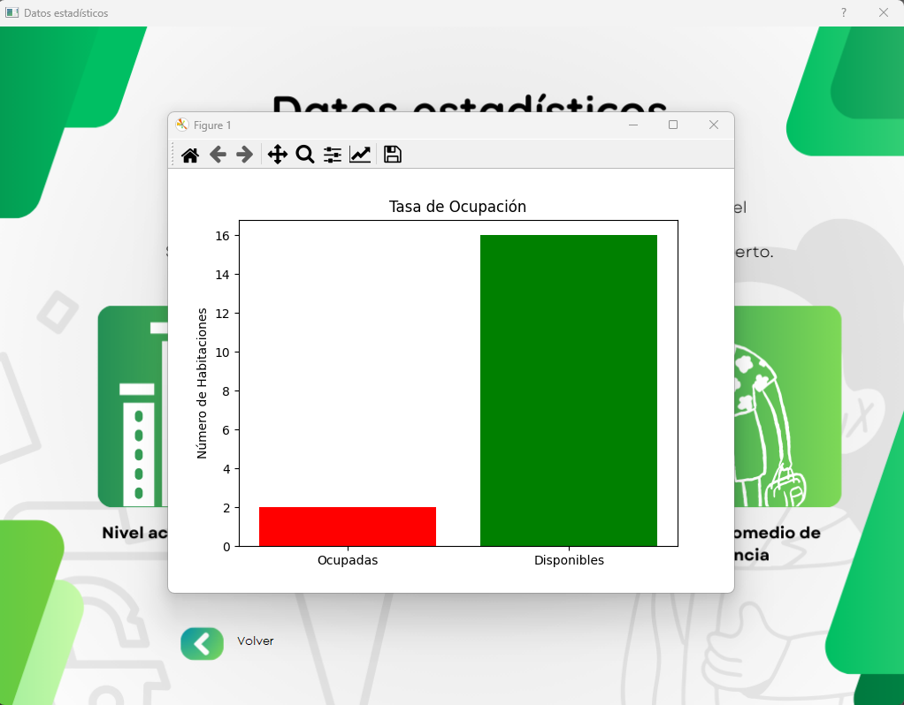

# Sistema de Gestión de Reservaciones para Hoteles, orientado a funcionar de manera local - ROOMIE.

Este proyecto es un sistema para poder gestionar de manera intuitiva las reservaciones en hoteles, permitiendo registrar, modificar y consultar los reportes de reservación, teninedo impacto directo en la disponibilidad. 
Por otro lado, el sistema es capáz de mostrar una serie de datos estadísticos relacionados al ritmo operación del hotel.

"Next Gen Software" es una empresa ficticia, creada unicamente con propositos para este proyecto. 

## Características
- Visualización de los activos del hotel, es decir cuáles son las habitacions con las que cuenta el hotel, sus características, precios, etc.
- Modulo de ayuda para que el usuario de vaya familiarizando con el sistema.
- Gestión de reservaciones: registro, modificación y consulta.
- Reportes detallados sobre las reservaciones actuales y almacenadas en el sistema. 
- Estadísticas visuales relacionadas con la ocupación y disponibilidad.
- Gestión de la disponibilidad: Al hacer un reporte de reservación, los estados de las habitaciones cambian a ocupado,
en caso de que la fecha de check out haya llegado, se puede volver a habilitar una habitación como disponible desde el
propio sistema.

## Tecnologías utilizadas
- **Lenguaje de programación:** Python
- **Framework para la interfaz gráfica:** PyQt Designer
- **Base de datos:** PostgreSQL
- **Herramienta de gestión de base de datos:** pgAdmin

## Cómo usar

El proyecto está realizado en un etorno virtual, por lo que las librerías vienen en la carpeta "entorno".

1. Clona este repositorio.
2. Las dependencias vienen ya precargadas en la  carpeta "entorno"
3. En pgAdmin, copia y pega el script para creación de la base de datos (script_bd.sql)
4. En pgAdmin, una vez tengas creada la base de datos "bd", copia y pega los scripts referentes a los triggers (triggers_habilitar_ocupar_habitaciones.sql)
5. Puedes moficar a tus gusto los activos del hotel en el Script (insertar_habitaciones.sql) y pegarlo en pgAdmin. De igual manera el script para los reportes.
6. Verifica que los datos de conexión hacía la base de datos sean correctos.
7. Puedes cambiar las credenciales de logeo en el archivo "login.py".
8. Ejecuta `main.py` para iniciar la aplicación.

## Capturas de pantalla

### Pantalla de Login

### Interfaz principal

### Modulo de ayuda

### Mostrar todas las habitaciones y sus caracteristicas

### Mostrar la disponibiliad de las habitaciones por medio de diversos filtros

### Iniciar un reporte de reservacion

### Consultar los reportes de reservacion y habilitar nuevamente una habitacion como "Disponible"

### Modulo para poder mostrar estadisticas operacionales del hotel, tomando en cuenta los datos almacenados en el sistema

### Ejemplo del modulo de estadisticas operaacionales - Nivel de ocupación del hotel

### Easter egg del sistema, que ofrece información del mismo, manual de recepcionista y objetivos

